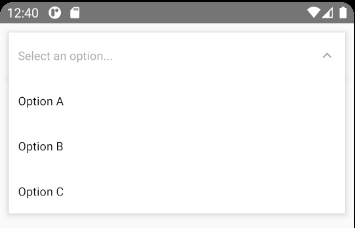

# Simple dropdown picker for react-native



## **Caution**

The package is under development, do not use it for production.

## Description

A simple searchable dropdown component for **react-native**. Components that I used had bugs when I tried to click on an option so I decided to create this component which uses absolute positioning to render the dropdown menu.

## Usage

You have to insert `<DropdownProvider />` in the top of your component hierarchy (e.g. `<App />`). Make sure there is **no parent view** up in the hierarchy so the dropdown can render itself relative to the app window. Specify the `<DropdownExit />` component, this will render the dropdown menu.
Your _App.tsx_ should look like this:

```js
<DropdownProvider>
  // Other components...
  <DropdownExit />
</DropdownProvider>
```

### Props

| Name                         | Description                                                                                                                    | Type                                                                         | Default              | Required |
| ---------------------------- | ------------------------------------------------------------------------------------------------------------------------------ | ---------------------------------------------------------------------------- | -------------------- | -------- |
| `options`                    | The options for the component.                                                                                                 | `Option[]`                                                                   | []                   | No       |
| `onOptionClicked`            | This callback fires when you select an option from the dropdown list                                                           | `(option: Option) => any`                                                    |                      | No       |
| `placeholder`                | Default text to be shown to the user when no option is selected.                                                               | `string`                                                                     | 'Select an option'   | No       |
| `searchable`                 | Set this to true to enable searching among options in the dropdown menu.                                                       | `boolean`                                                                    | false                | No       |
| `searchablePlaceholder`      | Default text to be shown in the search input.                                                                                  | `string`                                                                     | 'Search for an item' | No       |
| `onSearch`                   | This callback is called when user types into the search input. You have handle option filtering for yourself if you pass this. | `(text: string) => any`                                                      |                      | No       |
| `searchPlaheolderTextColor`  | Color of the placeholder inside the search input.                                                                              | `string`                                                                     | ?                    | No       |
| `showIndicatorIcon`          | Wether it should render indicator icon on the right to show dropdown state or not.                                             | `boolean`                                                                    | true                 | No       |
| `indicatorIcon`              | A render prop to render custom indicator icon on the left.                                                                     | `(isOpen: boolean, setDropdownOpen: (value: boolean) => any) => JSX.Element` |                      | No       |
| `leftIconForSelected`        | A render prop to render an icon on the left of the selected option.                                                            | `() => JSX.Element`                                                          |                      | No       |
| `dropdownContainerStyle`     | Custom style for the container view of the dropdown menu.                                                                      | `StyleProp<ViewStyle>`                                                       |                      | No       |
| `selectedContainerStyle`     | Custom style for the `<View />` that renders the selected option                                                               | `StyleProp<ViewStyle>`                                                       |                      | No       |
| `openSelectedContainerStyle` | Additional custom style for the `<View />` that renders the selected option when the dropdown is open.                         | `StyleProp<ViewStyle>`                                                       |                      | No       |
